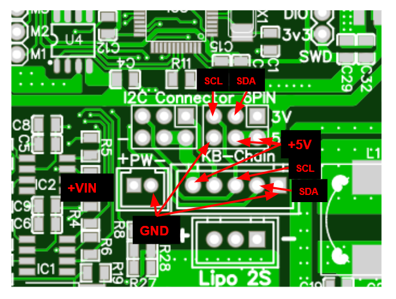

# AI_CAR_Driver
<html><head><meta content="text/html; charset=UTF-8" http-equiv="content-type"></head><body>

&#3588;&#3641;&#3656;&#3617;&#3639;&#3629;&#3585;&#3634;&#3619;&#3651;&#3594;&#3657;&#3591;&#3634;&#3609; &#3610;&#3629;&#3619;&#3660;&#3604; AI CAR Driver

&nbsp;&nbsp;&nbsp;&nbsp;&nbsp;&nbsp;&nbsp;&nbsp;&#3610;&#3629;&#3619;&#3660;&#3604; AI CAR Driver &#3648;&#3611;&#3655;&#3609;&#3648;&#3610;&#3629;&#3619;&#3660;&#3604;&#3607;&#3637;&#3656;&#3594;&#3656;&#3623;&#3618;&#3651;&#3609;&#3585;&#3634;&#3619;&#3586;&#3633;&#3610;&#3617;&#3629;&#3648;&#3605;&#3629;&#3619;&#3660; &#3651;&#3609;&#3610;&#3629;&#3619;&#3660;&#3604;&#3617;&#3637; HM-10 &#3648;&#3611;&#3655;&#3609;&#3610;&#3621;&#3641;&#3607;&#3641;&#3608; 4.0 &#3607;&#3637;&#3656;&#3648;&#3629;&#3634;&#3651;&#3623;&#3619;&#3633;&#3610;&#3586;&#3657;&#3629;&#3617;&#3641;&#3621;&#3592;&#3634;&#3585; APP Remote xy &#3607;&#3637;&#3656;&#3594;&#3656;&#3623;&#3618;&#3651;&#3609;&#3585;&#3634;&#3619;&#3610;&#3633;&#3591;&#3588;&#3633;&#3610;&#3619;&#3606; &#3649;&#3621;&#3657;&#3623;&#3626;&#3634;&#3617;&#3634;&#3619;&#3606;&#3604;&#3638;&#3591;&#3586;&#3657;&#3629;&#3617;&#3641;&#3621;&#3585;&#3634;&#3619;&#3610;&#3633;&#3591;&#3588;&#3633;&#3610;&#3619;&#3606;&#3619;&#3632;&#3627;&#3623;&#3656;&#3634;&#3591;&#3610;&#3633;&#3591;&#3588;&#3633;&#3610;&#3652;&#3604;&#3657; &#3617;&#3637;&#3619;&#3632;&#3610;&#3610;&#3648;&#3605;&#3639;&#3629;&#3609;&#3648;&#3623;&#3621;&#3634;&#3649;&#3610;&#3605;&#3648;&#3605;&#3629;&#3619;&#3637;&#3656;&#3605;&#3656;&#3635; &#3610;&#3629;&#3619;&#3660;&#3604;&#3619;&#3629;&#3591;&#3619;&#3633;&#3610;&#3652;&#3615;&#3652;&#3604;&#3657; 2s 3s 4s &#3648;&#3611;&#3655;&#3609;&#3649;&#3610;&#3605;&#3648;&#3605;&#3629;&#3619;&#3637;&#3656; &#3594;&#3609;&#3636;&#3604; lipo &#3626;&#3634;&#3617;&#3634;&#3619;&#3606;&#3626;&#3633;&#3656;&#3591;&#3651;&#3627;&#3657; SERVO &#3627;&#3617;&#3640;&#3609;&#3652;&#3604;&#3657;&#3629;&#3637;&#3585; 3 &#3594;&#3656;&#3629;&#3591;

PINOut 

&#3592;&#3640;&#3604;&#3605;&#3656;&#3629;&#3617;&#3629;&#3648;&#3605;&#3629;&#3619;&#3660;&#3627;&#3621;&#3633;&#3591; &#3649;&#3610;&#3610; DC Motor

&#3592;&#3640;&#3604;&#3605;&#3656;&#3629;&#3617;&#3629;&#3648;&#3605;&#3629;&#3619;&#3660; Servo 

def buzzer(timelong = 0): &nbsp;#&#3615;&#3633;&#3591;&#3594;&#3633;&#3657;&#3609;&#3648;&#3611;&#3636;&#3604;&#3648;&#3626;&#3637;&#3618;&#3591; &#3605;&#3633;&#3623;&#3648;&#3621;&#3586; 1 = 50mS &nbsp;&#3627;&#3619;&#3639;&#3629; 2 = 100mS

&nbsp; &nbsp; if timelong &gt;= 255 :

&nbsp; &nbsp; &nbsp; &nbsp; timelong = 255

&nbsp; &nbsp; a = i2c.writeto(0x12,bytes([int(timelong)]))

&nbsp; &nbsp; return a

def servomotor(M1 = 0,M2=0,M3=0,M4=0): &nbsp;# &#3615;&#3633;&#3591;&#3594;&#3633;&#3657;&#3609;&#3586;&#3633;&#3610;&#3650;&#3595;&#3650;&#3623;&#3617;&#3629;&#3648;&#3605;&#3629;&#3619;&#3660; &nbsp;&#3617;&#3637; 4 &#3594;&#3656;&#3629;&#3591; M1,M2,M3,M4 &#3588;&#3656;&#3634; 0-255 map 1000-2000 uS

&nbsp; &nbsp; if M1 &gt;= 255 :

&nbsp; &nbsp; &nbsp; &nbsp; M1 = 255

&nbsp; &nbsp; if M2 &gt;= 255 :

&nbsp; &nbsp; &nbsp; &nbsp; M2 = 255

&nbsp; &nbsp; if M3 &gt;= 255 :

&nbsp; &nbsp; &nbsp; &nbsp; M3 = 255

&nbsp; &nbsp; if M4 &gt;= 255 :

&nbsp; &nbsp; &nbsp; &nbsp; M4 = 255

&nbsp; &nbsp; a = i2c.writeto(0x12,bytes([int(M1),int(M2),int(M3),int(M4)]))

&nbsp; &nbsp; return a

def carmotor(FB = 128,LR = 128): &nbsp;# &#3615;&#3633;&#3591;&#3594;&#3633;&#3657;&#3609; FB &#3588;&#3639;&#3629; &#3648;&#3604;&#3636;&#3609;&#3627;&#3609;&#3657;&#3634; &#3606;&#3629;&#3618;&#3627;&#3621;&#3633;&#3591; &nbsp; LR &#3588;&#3639;&#3629; &nbsp;&#3648;&#3621;&#3637;&#3657;&#3618;&#3623;&#3595;&#3657;&#3634;&#3618; &#3586;&#3623;&#3634;

# &nbsp; &nbsp; if FB &gt;= 255 :

# &nbsp; &nbsp; &nbsp; &nbsp; FB = 255

# &nbsp; &nbsp; if LR &gt;= 255 :

# &nbsp; &nbsp; &nbsp; &nbsp; LR = 255

&nbsp; &nbsp; a = i2c.writeto(0x12,bytes([int(FB),int(LR),int(0)]))

&nbsp; &nbsp; return a

def setname_bl(_num = 0): &nbsp;# &#3615;&#3633;&#3591;&#3594;&#3633;&#3657;&#3609;&#3648;&#3611;&#3621;&#3637;&#3618;&#3609;&#3595;&#3639;&#3656;&#3629; Bl&#3651;&#3626;&#3656;&#3652;&#3604;&#3657;&#3649;&#3605;&#3656;&#3605;&#3633;&#3623;&#3648;&#3621;&#3586;&#3648;&#3607;&#3656;&#3634;&#3609;&#3633;&#3657;&#3609;

# &nbsp; &nbsp; if _num &gt;= &#3640;60000 :

# &nbsp; &nbsp; &nbsp; &nbsp; _num = 60000

&nbsp; &nbsp; _namenum = struct.pack(&quot;&gt;H&quot;, _num)

&nbsp; &nbsp; a = i2c.writeto(0x12,_namenum)

&nbsp; &nbsp; print(_namenum)

&nbsp; &nbsp; return a

&#3585;&#3634;&#3619;&#3651;&#3594;&#3657;&#3591;&#3634;&#3609;

</body></html>

# ลิ้ง colab ใหม่
# https://colab.research.google.com/drive/1f-GZjkCkGZP1l-rS-SjRB0rbfg_Dy5D2?usp=sharing
# plugin สำหรับ kbide
# https://github.com/cmmakerclub/kbide-plugin-AI_CAR_Driver
