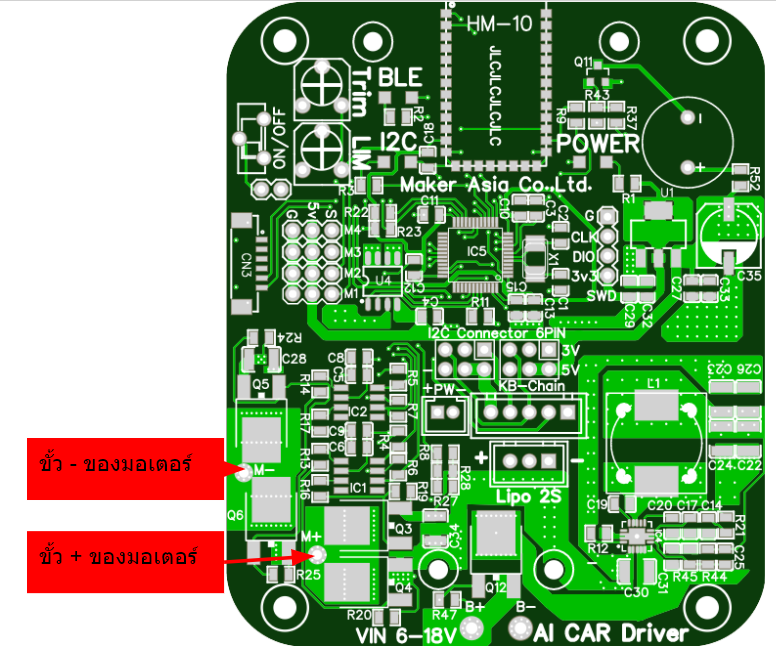
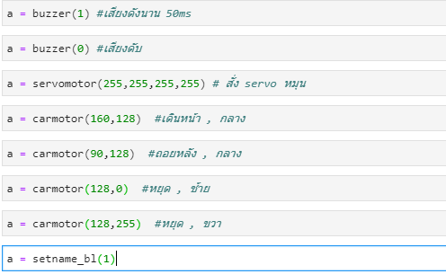

# AI_CAR_Driver

<strong>คู่มือการใช้งาน บอร์ด AI CAR Driver</strong>

<strong>	บอร์ด AI CAR Driver เป็นเบอร์ดที่ช่วยในการขับมอเตอร์ ในบอร์ดมี esp32 เป็น wifi ap ที่เอาใวรับข้อมูลจาก APP Remote xy ที่ช่วยในการบังคับรถ แล้วสามารถดึงข้อมูลการบังคับรถระหว่างบังคับได้ มีระบบเตือนเวลาแบตเตอรี่ต่ำ บอร์ดรองรับไฟได้ 2s 3s เป็นแบตเตอรี่ ชนิด lipo สามารถสั่งให้ SERVO หมุนได้อีก 3 ช่อง มีแหล่งจ่ายไฟ 5V 5A ให้เอาไปใช้งาน เหมาะสำหรับเอาไปทำรถ RC Car autonomous วิ่งตาม lane ถนน สามารถต่อกับ CorgiDude , KidBright , jetson nano และ raspberry pi</strong>

PINOut 

>>>>>  gd2md-html alert: inline image link here (to images/image1.png). Store image on your image server and adjust path/filename/extension if necessary.  (<a href="#">Back to top</a>)(<a href="#gdcalert2">Next alert</a>) >>>>> 

def buzzer(timelong = 0):  #ฟังชั้นเปิดเสียง ตัวเลข 1 = 50mS  หรือ 2 = 100mS

    if timelong >= 255 :

        timelong = 255

    a = i2c.writeto(0x12,bytes([int(timelong)]))

    return a

def servomotor(M1 = 0,M2=0,M3=0,M4=0):  # ฟังชั้นขับโซโวมอเตอร์  มี 4 ช่อง M1,M2,M3,M4 ค่า 0-255 map 1000-2000 uS

    if M1 >= 255 :

        M1 = 255

    if M2 >= 255 :

        M2 = 255

    if M3 >= 255 :

        M3 = 255

    if M4 >= 255 :

        M4 = 255

    a = i2c.writeto(0x12,bytes([int(M1),int(M2),int(M3),int(M4)]))

    return a

def carmotor(FB = 128,LR = 128):  # ฟังชั้น FB คือ เดินหน้า ถอยหลัง   LR คือ  เลี้ยวซ้าย ขวา

#     if FB >= 255 :

#         FB = 255

#     if LR >= 255 :

#         LR = 255

    a = i2c.writeto(0x12,bytes([int(FB),int(LR),int(0)]))

    return a

def setname_bl(_num = 0):  # ฟังชั้นเปลียนซื่อ Blใส่ได้แต่ตัวเลขเท่านั้น

#     if _num >= ุ60000 :

#         _num = 60000

    _namenum = struct.pack(">H", _num)

    a = i2c.writeto(0x12,_namenum)

    print(_namenum)

    return a

การใช้งาน

>>>>>  gd2md-html alert: inline image link here (to images/image2.png). Store image on your image server and adjust path/filename/extension if necessary.  (<a href="#">Back to top</a>)(<a href="#gdcalert3">Next alert</a>) >>>>> 

# ลิ้ง colab ใหม่
# https://colab.research.google.com/drive/1f-GZjkCkGZP1l-rS-SjRB0rbfg_Dy5D2?usp=sharing
# plugin สำหรับ kbide
# https://github.com/cmmakerclub/kbide-plugin-AI_CAR_Driver
